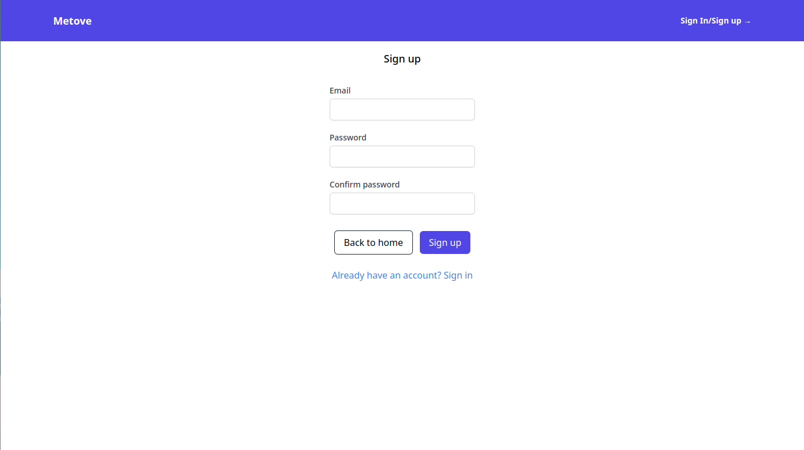
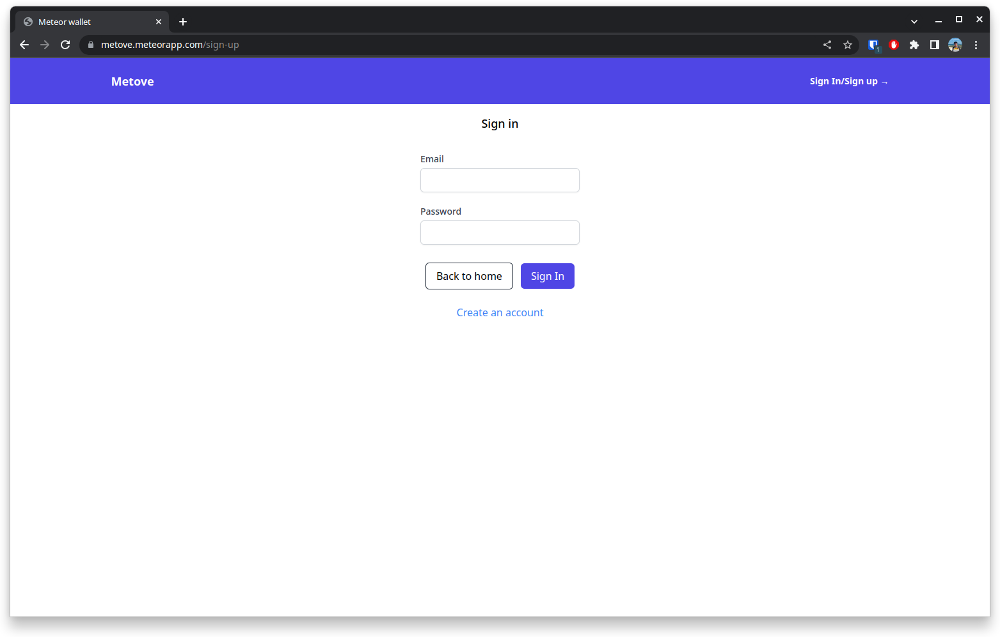
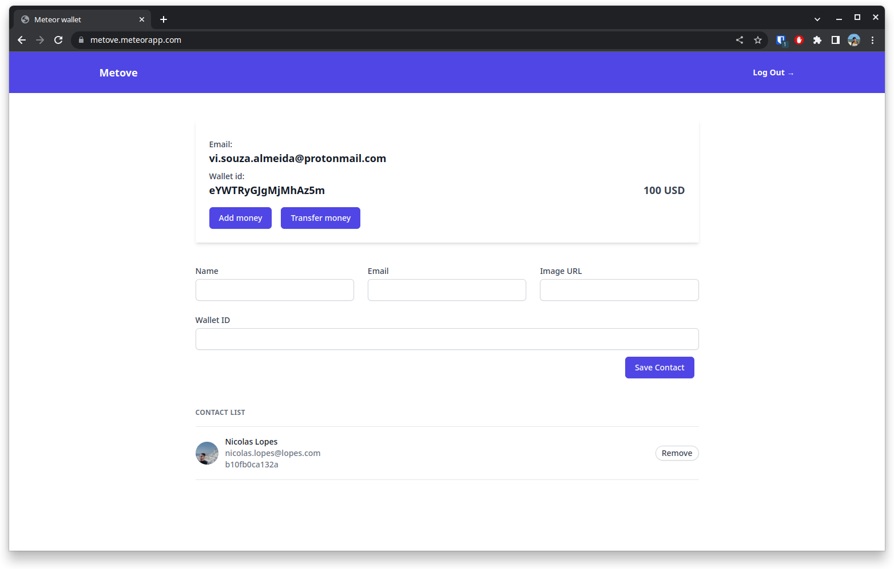

## [Metove](https://metove.meteorapp.com/)

This is a full-stack application. A simple wallet manager that allows you:

- Create wallet
- Add some money to your wallet
- Transfer money between wallets
- Remove wallets

It is using [Meteor](https://www.meteor.com/), TypeScript and TailwindCSS.

### How to run

- Clone the repository
- Run `meteor`

### Screenshots

#### Sign up 

#### Sign in 

#### Home 