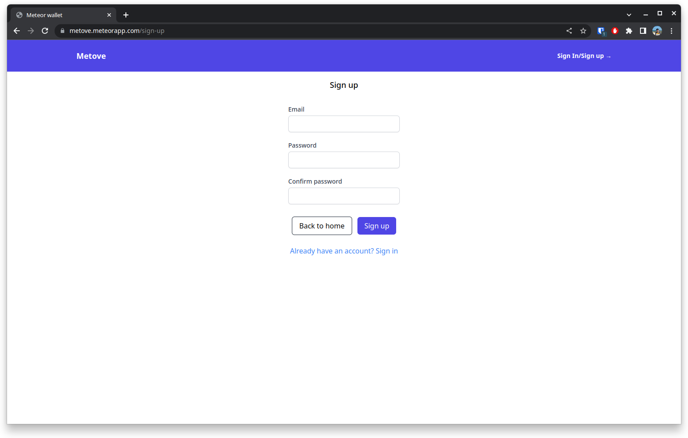

## [Metove](https://metove.meteorapp.com/)

#### About

This is a full-stack digital wallet project that I made to learn more about [MeteorJS](https://www.meteor.com/). It allows you to:

- Create wallet
- Add some money to your wallet
- Transfer money between wallets
- Remove wallets

#### Technologies used

- [MeteorJS](https://www.meteor.com/)
  - [ReactJS](https://reactjs.org/)
  - [MongoDB](https://www.mongodb.com/)
  - [TypeScript](https://www.typescriptlang.org/)
  - [TailwindCSS](https://tailwindcss.com/)
  - [React Router](https://reactrouter.com/en/main)

And some other related packages.

#### Features

- [x] Sign up
- [x] Sign in
- [x] Create wallet
- [x] Add money to wallet
- [x] Transfer money between wallets
- [x] Remove wallet
- [x] Security routes (only logged or admin users can access)

Admin features:

- [x] Delete some transaction

#### Deploy

To deploy this project I used [Meteor Cloud](https://www.meteor.com/cloud) that is a service provided by Meteor that allows you to deploy your app in a simple way.

#### How to run

- [Install](https://docs.meteor.com/install.html) Meteor
- Clone the repository
- Run `meteor`

#### Screenshots

    
Sign Up

    

    
Sign In

    

    
Home

    

